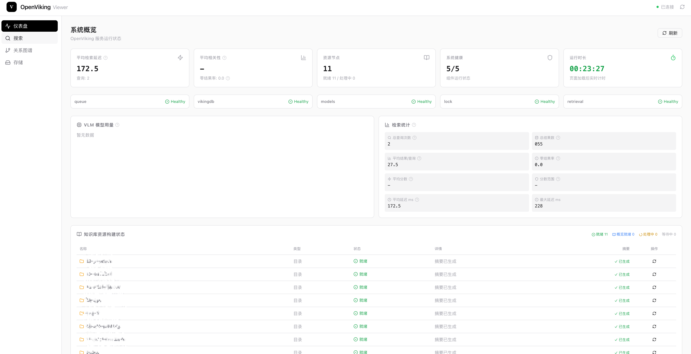
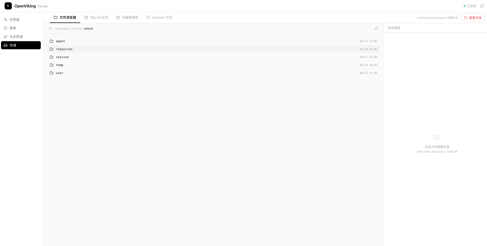

# OpenViking Viewer

> 🧭 Visualize & Explore your Vector Knowledge Base — Browse, Search, and Map your OpenViking knowledge graph in the browser

<p align="center">
  
  <em>仪表盘 — 一览系统健康度、存储概况与知识库构建状态</em>
</p>

<p align="center">
  
  <em>文件浏览器 — 树形浏览知识库目录结构与文件详情</em>
</p>

## ✨ 功能特性

- **📊 仪表盘** — 一览系统状态、服务健康度、存储概况
- **🔍 语义搜索** — 基于向量检索的知识库内容搜索
- **🕸️ 关系图谱** — D3.js 驱动的知识节点关系可视化
- **💾 存储管理** — Workspace 文件系统、VectorDB 元数据、Session 记录浏览
- **📂 目录树浏览** — 树形结构探索知识库层级
- **🔄 实时状态** — 自动检测 OpenViking 服务连接状态（30s 间隔）

## 🏗️ 技术栈

| 层级 | 技术 |
|------|------|
| 前端框架 | React 18 + TypeScript |
| 构建工具 | Vite 6 |
| 路由 | React Router v6 (HashRouter) |
| UI 样式 | Tailwind CSS 3 + CSS Variables |
| 图标 | Lucide React |
| 可视化 | D3.js (关系图谱) |
| 后端服务 | Node.js原生 HTTP (无框架) |
| 知识库后端 | [OpenViking](https://github.com/openviking/openviking) (localhost:1933) |

## 🚀 快速开始

### 前置要求

- **Node.js** >= 18.0.0
- **OpenViking CLI** (`ov` 命令可用)
- **OpenViking 服务**运行中（默认 `localhost:1933`）

### 安装与启动

```bash
# 1. 克隆项目
git clone https://github.com/lakshjsn/openviking-viewer.git
cd openviking-viewer

# 2. 安装依赖
npm install

# 3. 启动开发模式（前端 + 后端同时启动）
npm run dev

# 4. 打开浏览器访问
#    前端: http://localhost:5173
#    API:  http://localhost:3199
```

### 其他启动方式

```bash
# 仅启动前端
npm run dev:client

# 仅启动后端 API
npm run dev:server

# 生产构建
npm run build

# 预览构建产物
npm run preview
```

## ⚙️ 配置

### 环境变量

```bash
# 复制配置模板
cp .env.example .env
```

| 变量名 | 说明 | 默认值 |
|--------|------|--------|
| `OV_COMMAND` | ov CLI 命令路径 | `ov` (系统 PATH) |
| `OV_HOST` | OpenViking 服务地址 | `localhost` |
| `OV_PORT` | OpenViking 服务端口 | `1933` |
| `OV_STORAGE_PATH` | OpenViking 存储路径 | 无 |
| `OV_VIEWER_PORT` | Viewer API 端口 | `3199` |

### 常见配置问题

<details>
<summary>❌ 找不到 ov 命令</summary>

```bash
# 查找 ov 位置
which ov
find ~ -name "ov" -type f 2>/dev/null

# 使用完整路径启动
OV_COMMAND=$HOME/.cargo/bin/ov npm run dev
```

</details>

<details>
<summary>❌ 连接 OpenViking 失败</summary>

```bash
# 检查服务状态
ov health

# 自定义地址和端口
OV_HOST=<your-host-ip> OV_PORT=9000 npm run dev
```

</details>

<details>
<summary>❌ 端口被占用</summary>

```bash
# 使用其他端口
OV_VIEWER_PORT=3200 npm run dev
```

</details>

## 📁 项目结构

```
openviking-viewer/
├── server/                  # Node.js 后端 API 服务
│   ├── index.js             # 服务入口 & 路由表
│   ├── config.js            # 配置管理
│   ├── middleware.js        # CORS / JSON 中间件
│   ├── ov-client.js         # OpenViking CLI 调用封装
│   └── routes/              # API 路由处理
│       ├── status.js        # 系统 / 健康 / 版本
│       ├── browse.js        # 目录树 / 列表
│       ├── files.js         # 文件读取 / 摘要 / 统计
│       ├── search.js        # find / search / grep / glob
│       ├── relations.js     # 关系图谱数据
│       ├── workspace.js     # Workspace 文件操作
│       ├── vectordb.js      # VectorDB 元数据
│       ├── sessions.js      # Session 对话记录
│       ├── resources.js     # 资源构建状态
│       └── ...
├── src/
│   ├── App.tsx              # 应用根组件（布局 + 导航）
│   ├── main.tsx             # 入口文件
│   ├── index.css            # 全局样式
│   ├── api/client.ts        # 前端 API 客户端
│   └── pages/               # 页面组件
│       ├── Dashboard.tsx    # 仪表盘
│       ├── Search.tsx       # 搜索页
│       ├── Relations.tsx    # 关系图谱页
│       ├── Storage.tsx      # 存储管理页
│       └── Explorer.tsx     # 浏览器页
├── public/                  # 静态资源
├── .env.example             # 环境变量模板
├── vite.config.ts           # Vite 配置
├── tailwind.config.js       # Tailwind 配置
├── tsconfig.json            # TypeScript 配置
└── package.json
```

## 🔗 相关链接

- 详细配置指南 → [SETUP.md](./SETUP.md)
- 快速故障排除 → [QUICKSTART.md](./QUICKSTART.md)
- OpenViking 知识库 → https://github.com/openviking/openviking

